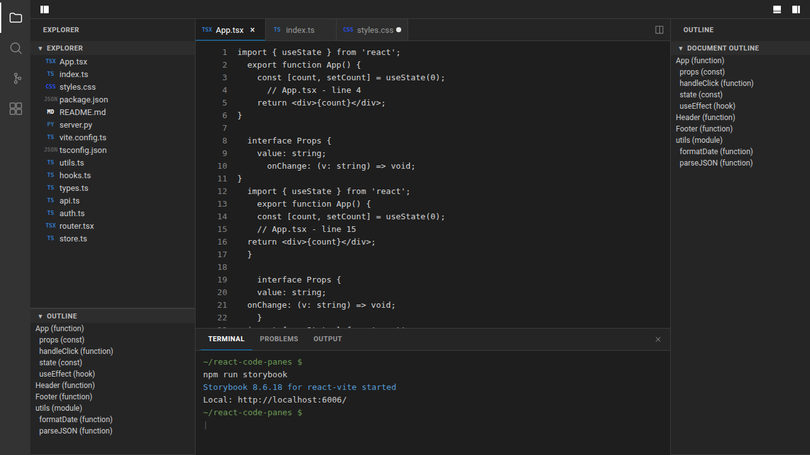

# react-code-panes

VS Code-style split panes, editor tabs, sidebars, and bottom panels for React.

It is a good fit for dashboards and inspector-style interfaces where the main content is already React components: code viewers, AI trajectories, logs, diffs, evaluation details, or other drill-down panels.



The package is framework-agnostic on the React side and ships plain CSS for layout and theming. It works fine in Tailwind apps, but it is not implemented with Tailwind classes.

## Features

- Nested horizontal and vertical split panes with draggable sashes
- Editor tab groups with close, reorder, split, dirty, preview, and MRU behavior
- Left and right sidebars with collapsible, resizable, reorderable sections
- Bottom panel with draggable tabs and persisted active-tab state
- Cross-container drag between sidebars, panel, and editor tabs
- Built-in code review primitives: `CodeFileTree`, `ChangedFilesList`, `MonacoCodeViewer`, `MonacoDiffViewer`, `UnifiedDiffPreview`
- Built-in agent trace support via `AgentTraceViewer` and `parseAgentTrace(...)`
- Self-contained file and folder icons plus git-status colors
- Dark and light themes via CSS custom properties
- TypeScript types and Storybook examples with Playwright coverage, including screenshot checks

## Install

```bash
npm install react-code-panes
```

Import the packaged stylesheet once in your app:

```tsx
import "react-code-panes/styles.css";
```

## Quick Start

The main thing to know: `Workbench` fills the size of its parent. In most apps you will embed it inside an existing layout region with a bounded height, not mount it fullscreen.

The core mental model is simple:

- your app renders whatever custom sidebar or panel UI it wants
- that UI creates tabs with a stable `id`
- `activateOrOpenTab(...)` reuses the existing tab when that `id` is already open

```tsx
import "react-code-panes/styles.css";
import {
  Workbench,
  createLeaf,
  useActiveWorkbenchGroupId,
  useWorkbenchActions,
} from "react-code-panes";
import type { SidebarSection, Tab, TabFactory } from "react-code-panes";

type ReviewItem = {
  id: string;
  title: string;
  subtitle: string;
  summary: string;
  accent: string;
};

const reviewItems: ReviewItem[] = [
  {
    id: "run:review-candidate-a",
    title: "Review candidate A",
    subtitle: "Primary review candidate",
    summary: "Strongest local result from the April 10 runs.",
    accent: "#4ec9b0",
  },
  {
    id: "finding:exit-sentinel",
    title: "Completion sentinel fix",
    subtitle: "Prompt contract mismatch",
    summary: "The harness prompt clobbered the agent's native completion sentinel.",
    accent: "#f2cc60",
  },
];

const makeReviewTab: TabFactory<ReviewItem> = (item) => ({
  id: item.id,
  title: item.title,
  labelColor: item.accent,
  content: (
    <div style={{ padding: 20, display: "grid", gap: 12 }}>
      <div style={{ fontSize: 24, fontWeight: 600 }}>{item.title}</div>
      <div style={{ color: "#9da5b4" }}>{item.subtitle}</div>
      <div style={{ lineHeight: 1.7 }}>{item.summary}</div>
    </div>
  ),
});

function ReviewQueue() {
  const actions = useWorkbenchActions();
  const activeGroupId = useActiveWorkbenchGroupId();

  return (
    <div style={{ padding: 8, display: "grid", gap: 6 }}>
      {reviewItems.map((item) => (
        <button
          key={item.id}
          type="button"
          onClick={() => {
            if (!activeGroupId) return;
            actions.activateOrOpenTab(activeGroupId, makeReviewTab(item));
          }}
          style={{
            textAlign: "left",
            border: "1px solid rgba(255,255,255,0.08)",
            background: "rgba(255,255,255,0.025)",
            color: "inherit",
            padding: 10,
            cursor: "pointer",
          }}
        >
          <div style={{ fontWeight: 600 }}>{item.title}</div>
          <div style={{ fontSize: 12, color: "#8b949e", marginTop: 4 }}>{item.subtitle}</div>
        </button>
      ))}
    </div>
  );
}

const leftSidebarSections: SidebarSection[] = [
  {
    id: "queue",
    title: "Queue",
    content: <ReviewQueue />,
  },
];

export function ReviewWorkbench() {
  return (
    <section style={{ minHeight: 560, height: "70vh", border: "1px solid #2d2d2d" }}>
      <Workbench
        theme="dark"
        initialState={{
          splitTree: createLeaf("main"),
          groups: {
            main: {
              tabs: [makeReviewTab(reviewItems[0])],
              activeTabId: reviewItems[0].id,
              mruOrder: [reviewItems[0].id],
            },
          },
          activeGroupId: "main",
        }}
        leftSidebar={{
          title: "Explorer",
          sections: leftSidebarSections,
          defaultWidth: 280,
          minWidth: 200,
        }}
      />
    </section>
  );
}
```

## Tab Identity And Lifecycle

`react-code-panes` is intentionally React-first.

- A tab is just metadata plus mounted React content.
- `id` is the logical identity for that tab.
- Calling `activateOrOpenTab(groupId, tab)` with an already-open `id` focuses the existing tab instead of opening a duplicate.
- The existing tab is refreshed with the latest title, icon, color, and content you pass in.
- Inactive editor tabs stay mounted while they remain open, so local component state can stay alive.
- Explicit split actions are the exception: splitting a tab intentionally creates a second view of the current content in another editor group.

The public `Tab` shape is:

```ts
interface Tab {
  id: string;
  title: string;
  icon?: React.ReactNode;
  content: React.ReactElement;
  isDirty?: boolean;
  isPinned?: boolean;
  isPreview?: boolean;
  closable?: boolean;
  labelColor?: string;
}
```

If you like the “tab factory” pattern, the package also exports:

```ts
type TabFactory<T> = (item: T) => Tab;
```

## Layout Pattern

`Workbench` uses `width: 100%` and `height: 100%`, so the parent element must define the available size.

Typical patterns:

- a dashboard card or page region with a fixed or viewport-relative height
- a CSS grid area with `min-height: 0`
- a flex child that gets remaining space from an app shell

Example:

```tsx
<div style={{ display: "grid", gridTemplateRows: "auto minmax(0, 1fr)", height: "100vh" }}>
  <Header />
  <main style={{ minHeight: 0 }}>
    <ReviewWorkbench />
  </main>
</div>
```

## Custom Views Opening Custom Tabs

The library does not require a file tree model.

Your custom UI can be:

- a queue of runs
- a trace list
- a search results pane
- a timeline
- a notebook outline
- a totally fake tree or flat list

As long as that UI can turn an item into a `Tab`, it can drive the workbench.

Storybook includes a dedicated `Workbench / Custom Views Open Tabs` example showing plain React sidebar rows opening and dragging custom tabs without using `CodeFileTree` or `ChangedFilesList`.

## Built-in Review Components

If you want a stronger default out of the box, the package exports a small review-oriented component set:

- `CodeFileTree` for nested explorer trees with file icons, status badges, and optional drag-to-tab behavior
- `ChangedFilesList` for compact changed-file sidebars
- `MonacoCodeViewer` for read-only file views
- `MonacoDiffViewer` for before/after file diffs
- `UnifiedDiffPreview` for full unified patch inspection
- `AgentTraceViewer` for rendered agent traces
- `parseAgentTrace(raw)` for Claude Code, Codex CLI, OpenCode, Gemini CLI, and mini-swe-agent trace formats

The flagship Storybook workbench uses these pieces together to show a realistic review surface rather than a toy fullscreen editor.

## Styling

The library uses scoped class names under `.mosaic-workbench` and `.mosaic-*`, so it generally coexists cleanly with app CSS and Tailwind.

- It does not reset global `html`, `body`, or element styles outside the workbench container.
- It does ship plain CSS with fixed layout rules for the workbench itself.
- Colors, fonts, and many visual tokens are exposed as CSS custom properties.

Override tokens on `.mosaic-workbench` or a parent element:

```css
.mosaic-workbench {
  --mosaic-bg: #111827;
  --mosaic-tab-border-active: #22c55e;
  --mosaic-sash-hover: #22c55e;
  --mosaic-font-family: "Inter", sans-serif;
}
```

## Tailwind Compatibility

Yes. The package is compatible with Tailwind apps.

- Use Tailwind for the surrounding page and for content you render inside tabs or sidebars.
- Import `react-code-panes/styles.css` once so the workbench layout styles are present.
- Override the CSS variables or add targeted selectors if you want the workbench to match your design system.

## Components

### `<Workbench>`

Top-level layout component that combines the activity bar, sidebars, editor area, and bottom panel.

Key props:

- `initialState`: initial split tree, groups, and active group
- `leftSidebar`: left sidebar configuration
- `rightSidebar`: right sidebar configuration
- `panel`: bottom panel configuration
- `activityBar`: activity bar items
- `showToolbar`: show or hide the toolbar
- `theme`: `"dark"` or `"light"`

### Hooks

- `useWorkbench()` for direct access to state and dispatch
- `useWorkbenchActions()` for tab and layout actions
- `useActiveWorkbenchGroupId()` for the current target group when your custom UI wants to open tabs

### Lower-level components

The package also exports `TabBar`, `EditorGroup`, `Sidebar`, `Panel`, and split-tree utilities (`createLeaf`, `createBranch`) for advanced or custom setups.
